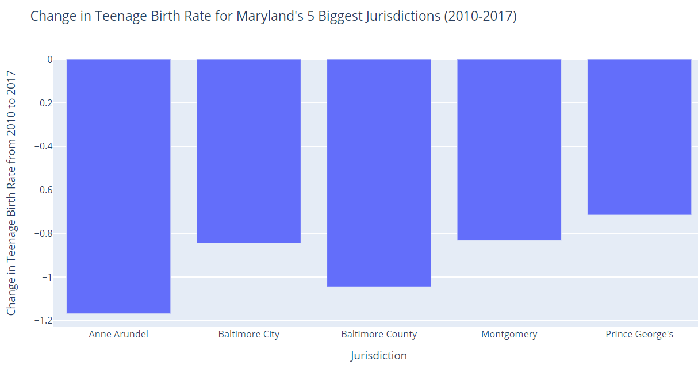
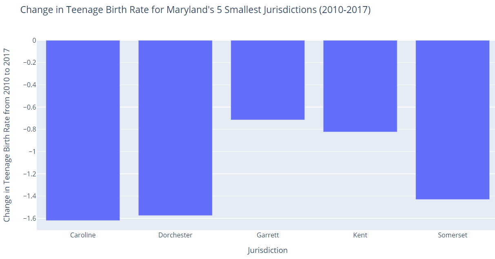
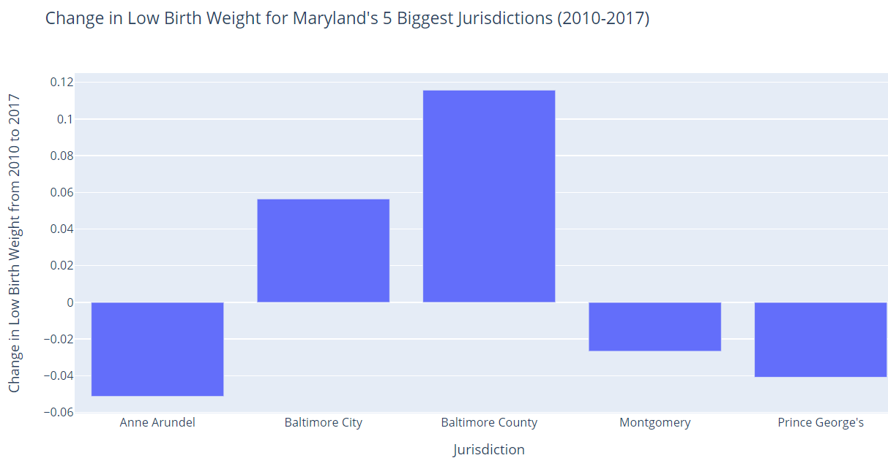
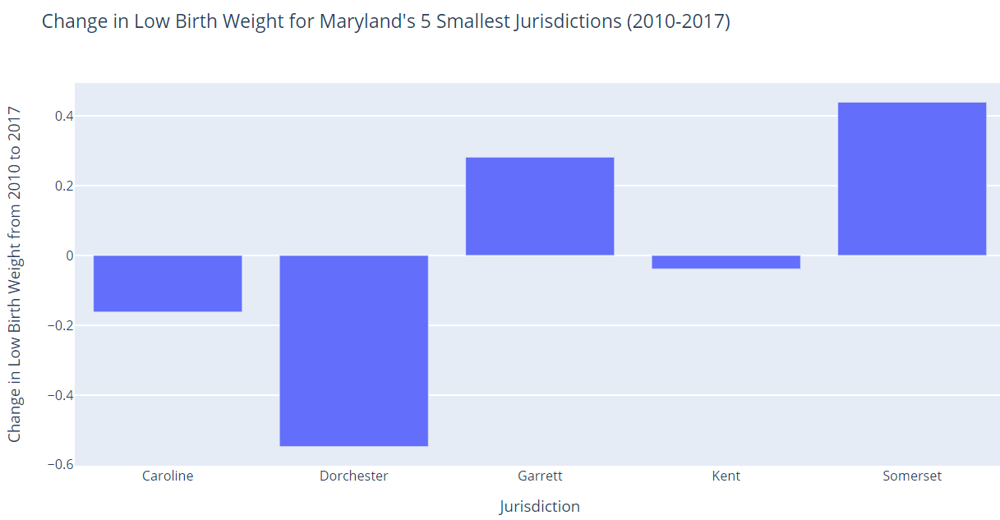
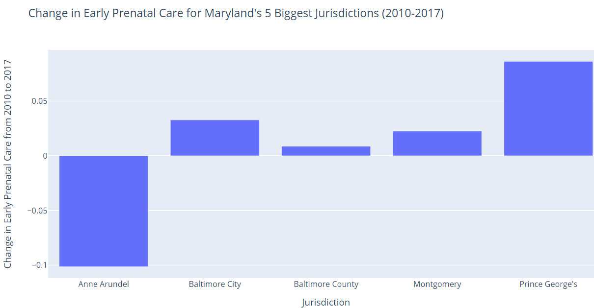
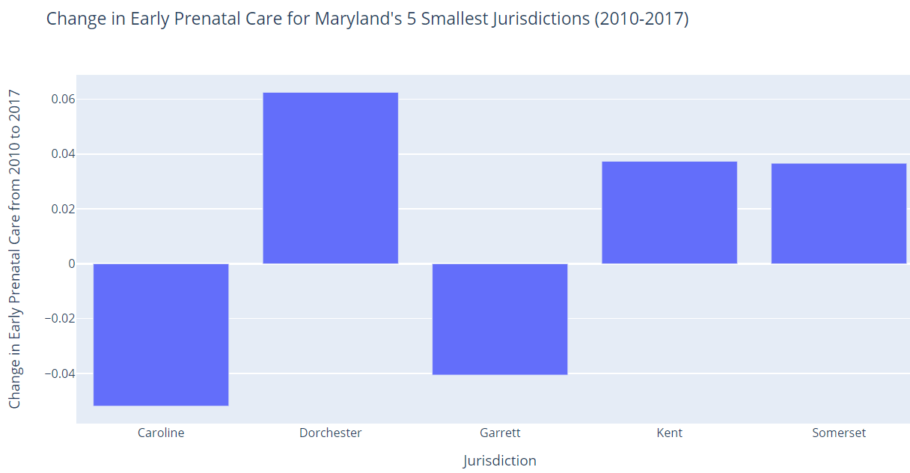

# Examining Trends in Teen Birth Rate, Access to Early Prenatal Care, and Babies with Low Birth Weight in Maryland, 2010-2017

## Background
According to [March of Dimes](https://www.marchofdimes.org/Peristats/ViewTopic.aspx?reg=24&top=1&lev=0&slev=4), in an average week in Maryland, 1,406 babies are born, 139 babies are born preterm, 120 babies are born at a low birth weight, and nine babies die before the age of one. In 2018, the low birth weight rate of Maryland was [8.8%](https://www.marchofdimes.org/Peristats/ViewTopic.aspx?reg=24&top=4&lev=0&slev=4), which did not reach the Healthy People 2020 goal of a rate of 7.8% or lower. According to the same source, black babies were about two times as likely as white babies to be born at a low birth weight from 2016 to 2018, on average. In 2018, in Maryland, [74.6%](https://www.marchofdimes.org/peristats/ViewTopic.aspx?reg=24&top=5&lev=0&slev=4) of live births were to women receiving early prenatal care, 18.8% were to women starting prenatal care in their second trimester, and 6.6% were to women who received late or no prenatal care at all. About one in six infants was born to a mother receiving inadequate prenatal care in Maryland at the time. 

It is [known](https://www.ncbi.nlm.nih.gov/books/NBK219236/) that teenage pregnancy is linked to many adverse outcomes for both the mother and child, including low birth weight, health problems from poor perinatal outcomes, increased risk of perinatal death, and poor academic achievement in the child. Babies born with low birth weight have a [higher risk](https://www.marchofdimes.org/complications/low-birthweight.aspx.) of heart disease, diabetes, high blood presusure, intellectual and developmental disabilities, obesity and metabolic syndrome. [Research](https://www.womenshealth.gov/a-z-topics/prenatal-care) has also shown that access to prenatal care is very important for a healthy pregnancy, and the babies of mothers who do not have access to prenatal care are three times more likely to have low birth weight and five times more likely to die. 

## Abstract

This report examines trends in reproductive health in Maryland from 2010 to 2017. The report explores teenage birth rate, access to early prenatal care, and babies with low birth weight as it is known that there can be negative consequences associated with these factors, or a lack thereof. The report identifies three counties for the Maternal and Child Health Bureau of the Maryland Department of Health to place focus on: Prince George’s, Garrett, and Somerset Counties. Public health initiative recommendations for the Bureau to implement for these three ounties include access to free contraceptives, improved sex and pregnancy education, increased funding for prenatal care centers and transportation to the centers, and partnerships with local county health departments. 

## Business Question 
How have teen birth rate, access to early prenatal care, and the number of babies with low birth weight impacted the population of Maryland? How can trends and patterns in these variables inform local and/or state policy?

## Metrics 
1. Teen Birth Rate 
2. Low Birth Weight
3. Early Prenatal Care 

## Data Sources
 - We used data from the [Maryland Open Data Portal](https://opendata.maryland.gov/) to examine these three variables
   - We used health data from the SHIP program-- which falls under Human and Health Services-- because it was fairly consistent across variables
      - SHIP is the State Health Improvement Process
   - Sources
      - [SHIP Teen Birth Rate from 2010-2017](https://opendata.maryland.gov/Health-and-Human-Services/SHIP-Teen-Birth-Rate-2010-2017/t8wg-hb7j)
      - [SHIP SHIP Early Prenatal Care 2010-2017](https://opendata.maryland.gov/Health-and-Human-Services/SHIP-Early-Prenatal-Care-2010-2017/48en-6hyz)
      - [SHIP Babies with Low Birth Weight 2010-2017](https://opendata.maryland.gov/Health-and-Human-Services/SHIP-Babies-with-Low-Birth-Weight-2010-2017/cyet-5jd3)

## Data Analysis Methods
1. Trends in the three selected variables: Python/Google Colaboratory
2. Percent Change in the three selected variables: [Python/Google Colaboratory](https://colab.research.google.com/drive/1QUmTvWJn7qQ4KBY9saS84pE6xG56tdcX#scrollTo=5ecr-_WY-Oec)
3. Cluster Analysis: Excel (see attached files, labeled 'Final project Cluster Analysis') 

## Overview of Data Findings 

Several counties within Maryland displayed relatively high teen birth rates, high low birth weight, and low early prenatal care based on the trends, percent change, and cluster analyses, but emphasis for improvement can be placed to Prince George's, Garrett, and Somerset Counties.

## Data Visualizations 

**Teen Birth Rate** 

Enter a sentence describing the graphs here:
put trends analysis graphs here

Enter a sentence describing the graphs here:
 
 

**Low Birth Weight** 

Enter a sentence describing the graphs here:
put trends analysis graphs here

Enter a sentence describing the graphs here:
 
 

**Early Prenatal Care** 

Enter a sentence describing the graphs here:
put trends analysis graphs here

Enter a sentence describing the graphs here:
 
 

## Recommendations for Maternal and Child Health Bureau
1. Free Contraceptives in Public Secondary Schools 
2. Strengthened Sex & Pregnancy Education 
3. Increased Funding for Prenatal Care Centers 
4. Increased Transportation to Prenatal Care Centers 
5. Partnerships with Local County Health Departments

